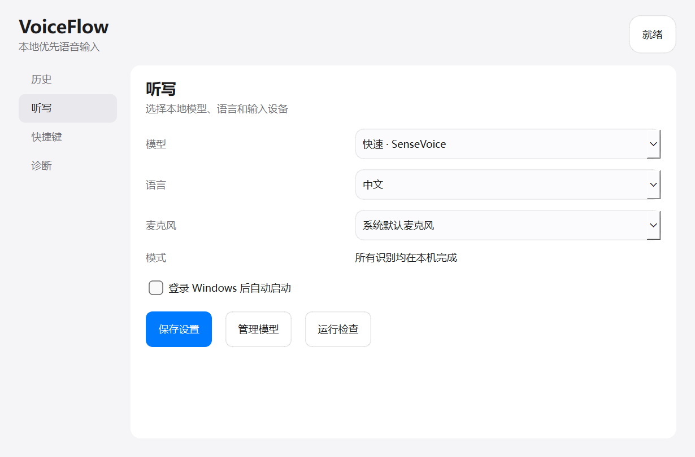

# VoiceFlow

> Offline, immediate, never lost.

[](README.md)
[](README.en.md)

[](#)
[](#)
[](#)
[](#)



<table>
  <tr>
    <td align="center"><br><sub>Listening: the meter follows real microphone energy</sub></td>
    <td align="center"><br><sub>Live preview: latest tail only, with no render backlog</sub></td>
  </tr>
  <tr>
    <td align="center"><br><sub>After stop: complete the final audio tail</sub></td>
    <td align="center"><br><sub>Complete: text is in the clipboard and local history</sub></td>
  </tr>
</table>

VoiceFlow is local-first dictation for Windows. It treats speech as live input,
not as a file to process: press `F2`, `Right Ctrl`, or a mouse side button,
speak, press again, and the final text is copied to the clipboard before
VoiceFlow attempts to paste it at the current cursor.

The product contract is simple: **recognized text must not be lost.** If the
target app does not accept paste, the text is still recoverable from the
clipboard and local history.

VoiceFlow has no hidden cloud ASR calls and no default LLM correction layer.
Codex is used for engineering workflow support, not as a runtime dependency.

## Why It Matters

- **System input layer**: designed for real cursor-level dictation across apps.
- **Final output is truth**: streaming preview is only feedback.
- **Truthful input feedback**: the 18 px meter follows real microphone RMS instead of playing a decorative loop, and its UI channel keeps only the latest frame.
- **Clipboard-first recovery**: paste can fail; text should not disappear.
- **Long dictation support**: stable segments are cached while recording, with a
  final tail pass on stop.
- **Local delivery path**: bootstrap can repair Python dependencies, logs, and
  shortcuts; model download is visible and user-confirmed.
- **Quality gate**: doctor, compile checks, pytest, benchmark, and integration
  are wired into `scripts\verify.py`.

## Tech Stack

- Python 3.12 on Windows
- PySide6 + Qt WebEngine on the LGPL release path
- `sherpa-onnx` adapters for SenseVoice, Qwen3-ASR, and Fun-ASR Nano
- Offline Silero VAD before ASR suppresses silence hallucinations without deleting genuine one-word dictation
- `sounddevice`, `keyboard`, and `pynput`
- `pyperclip` plus simulated `Ctrl+V`
- PyInstaller for packaged builds

GitHub's language bar reports source-code composition. Speech language is
configured separately in `config.yaml`; the default is `zh`, with model-backed
settings such as `zh`, `en`, and `auto`.

## Quick Start

```bat
git clone https://github.com/qinxujunai/VoiceFlow.git
cd VoiceFlow
start.bat
```

`start.bat` validates the virtual environment, installs dependencies when
needed, creates logs, restores the desktop shortcut, and opens a visible setup
path if the local ASR model is missing.

Models are intentionally kept out of Git. To download the default model:

```bat
venv\Scripts\python.exe scripts\download_models.py
```

## Shortcuts

| Key | Action |
| --- | --- |
| `F2` | Start / stop dictation |
| `Right Ctrl` | Start / stop dictation |
| `xbutton1` / `xbutton2` | Start / stop with mouse side buttons |
| `Esc` | Cancel current recording |

## Architecture

```text
Hotkey
  -> RecordingSession
  -> AudioCapture
  -> Transcriber
  -> TextCleaner + Vocabulary
  -> Clipboard
  -> Ctrl+V
  -> logs/history.jsonl
```

For short recordings, VoiceFlow runs one complete final pass. For long
recordings, it caches stable final segments while recording, then transcribes
the remaining tail on stop and de-duplicates transcript joins.

Live preview work is duration-independent: it reads a bounded recent audio
window, releases PCM after stable segments are cached, drops stale recognition
results, and coalesces UI updates into a one-slot latest-only queue. The final
path still covers the complete recording.

## Verification

```bat
venv\Scripts\python.exe scripts\verify.py
```

The gate runs doctor, py_compile, pytest, 500 deterministic lifecycle cycles, a
quick ASR benchmark, and integration. `scripts\verify.py --release` also
enforces recorded responsiveness evidence.

Model promotion is handled by `scripts\evaluate_asr.py`. It writes per-sample
JSONL results and refuses promotion when coverage or any hard product gate is
missing. Runtime audio and private evaluation data stay local.

## Maintenance

- [Quality gate](docs/quality-gate.md)
- [ASR evaluation plan](docs/asr-evaluation-plan.md)
- [Release checklist](docs/release-checklist.md)
