# VoiceFlow

> Local-first dictation for Windows. Press a key, speak, and your text lands at the cursor.

[](#)
[](#)
[](#)
[](#)



VoiceFlow is a small Windows dictation layer built around one product promise:
**if VoiceFlow recognizes text, the text must not be lost.** It copies the final text
to the clipboard first, then attempts to paste it at the current cursor. If paste
does not land anywhere, the text is still available in the clipboard and local
history.

VoiceFlow is intentionally not a cloud assistant. There are no hidden cloud ASR
calls and no default LLM correction layer. The default path is local, fast,
inspectable, and boring in the best way.

## Highlights

- **Push-to-talk dictation**: press `F2`, `Right Ctrl`, or a mouse side button to
  start and stop.
- **Local ASR by default**: SenseVoice-Small int8 through `sherpa-onnx`.
- **Streaming preview**: a compact bottom-centered pill shows live text while you
  speak; long recordings use a recent audio window to stay responsive.
- **Progressive final transcription**: short recordings use one complete final
  pass; long recordings cache stable audio segments while you speak and finish
  only the tail on stop.
- **Never-lost output**: final text goes to clipboard before `Ctrl+V`.
- **Local history**: successful outputs are appended to `logs/history.jsonl`.
- **Deterministic cleanup**: `TextCleaner` and `knowledge-base/corrections.txt`
  handle stable, known ASR mistakes without calling a model.
- **Native-feeling overlay**: the pill grows with text, preserves the last text
  during processing, and resets invisibly before the next recording.

## Quick Start

```bat
start.bat
```

Or run the app directly:

```bat
venv\Scripts\python.exe src\main.py
```

### Shortcuts

| Key | Action |
| --- | --- |
| `F2` | Start / stop dictation |
| `Right Ctrl` | Start / stop dictation |
| `xbutton1` / `xbutton2` | Start / stop dictation with mouse side buttons |
| `Esc` | Cancel the current recording without output |

The tray menu can show the window, copy the last result, paste the last result
again, open the dictionary folder, and exit the app.

## How It Works

```text
Hotkey
  -> RecordingSession
  -> AudioCapture
  -> Transcriber
  -> TextCleaner + Vocabulary
  -> Clipboard
  -> Ctrl+V
  -> logs/history.jsonl
```

The streaming text you see while speaking is only a preview. For short
recordings, stopping still runs one complete final pass. For long recordings,
VoiceFlow progressively transcribes stable audio segments during recording, then
only finishes the remaining tail when you stop. The final output still covers
the complete stopped audio; the UI preview never becomes the source of truth. If
final transcription returns empty but a streaming preview exists, VoiceFlow uses
the preview as a safety fallback.

## Project Structure

```text
src/
  main.py              # orchestration, lifecycle, streaming preview
  hotkey_manager.py    # F2, Right Ctrl, mouse side buttons
  recording_session.py # recording lifecycle
  audio_capture.py     # microphone adapter
  transcriber.py       # sherpa-onnx ASR
  text_cleaner.py      # deterministic cleanup and corrections
  vocabulary.py        # layered local vocabulary
  output_handler.py    # clipboard first, then Ctrl+V
  history_store.py     # JSONL history
  overlay_webview.py   # PyQt overlay and tray bridge
  overlay.html         # compact pill UI
  tray_icon.py         # runtime tray icons
scripts/
  benchmark_models.py  # local ASR benchmark
  add_correction.py    # add wrong=correct pairs
  create_shortcut.ps1  # desktop shortcut
  generate_icon.py     # app icon
```

## Accuracy Workflow

VoiceFlow does not pretend a plain word list is ASR hotword injection. Today,
the output-changing path is deterministic:

1. Record real private samples.
2. Write a JSONL manifest with `reference` and important `terms`.
3. Run the benchmark.
4. Add stable ASR mistakes to `knowledge-base/corrections.txt`.
5. Re-run the benchmark and compare raw vs clean output.

Example:

```bat
venv\Scripts\python.exe scripts\benchmark_models.py --manifest eval\private\local.jsonl
venv\Scripts\python.exe scripts\add_correction.py "科瑟" "Cursor"
```

## Verification

```bat
venv\Scripts\python.exe -m py_compile src\main.py src\overlay_webview.py src\hotkey_manager.py src\output_handler.py src\text_cleaner.py
venv\Scripts\python.exe -m pytest tests -q
venv\Scripts\python.exe scripts\benchmark_models.py --limit 3
venv\Scripts\python.exe test_integration.py
```

## Packaging

```bat
venv\Scripts\pyinstaller.exe VoiceFlow.spec
```

`VoiceFlow.spec` includes the overlay, config, knowledge base, and app icon.
Large model files are intentionally kept outside the executable under `models/`.

## 中文说明

VoiceFlow 是一个 Windows 本地优先语音输入工具。按 `F2`、`右 Ctrl` 或鼠标侧键开始说话，再按一次停止，最终文本会先进入剪贴板，再尝试粘贴到当前光标位置。

它的底线很简单：**只要识别出了文字，文字就不能丢。** 即使当前没有可输入的文本框，结果也会留在剪贴板和本地 `logs/history.jsonl` 里。

当前设计重点：

- 默认离线运行，不做隐藏云调用。
- 不默认接入大模型校对，避免慢、跑偏和交互不稳定。
- 录音中显示实时预览；长语音会边录边缓存稳定音频段，停止时只补最后尾巴，最终输出仍覆盖完整音频。
- 悬浮胶囊保持克制：文字自然生长，满宽后平滑追随，处理时保留最后文本。
- 准确率优先走本地可控闭环：真实样本评测，加确定性的 `wrong=correct` 修正。

## Roadmap

- Better visual regression coverage for the overlay.
- More benchmark manifests for Chinese and mixed Chinese-English dictation.
- A release build flow that keeps models external but setup simple.
- Optional model comparison only when local benchmarks prove a better tradeoff.
