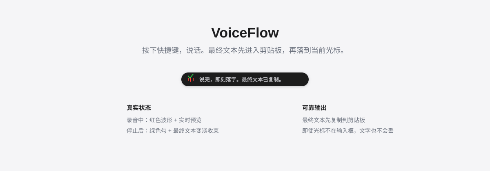

# VoiceFlow

> 离线，即刻，不丢一个字。

[](README.md)
[](README.en.md)

[](#)
[](#)
[](#)
[](#)



VoiceFlow 是一个本地优先的 Windows 语音输入层。它不把语音当成文件处理，而是把说话变成当前光标处的即时输入：
按 `F2`、`右 Ctrl` 或鼠标侧键开始说话，再按一次停止，最终文本会先进入剪贴板，再尝试粘贴到当前光标位置。

它的核心承诺很简单：**只要识别出了文字，文字就不能丢。** 如果当前应用没有可编辑输入框，或者 `Ctrl+V` 没有落到目标位置，结果仍然保留在剪贴板和本地历史里。

VoiceFlow 默认离线运行。没有隐藏云 ASR 调用，也没有默认大模型润色链路。Codex 只用于开发和维护流程，不是运行时依赖。

## 为什么这个项目值得看

- **系统级输入层**：不是文件转写器，而是面向任意应用的即时语音输入。
- **最终结果可信**：流式预览只负责反馈，真正输出永远来自最终转写路径。
- **剪贴板优先**：先复制，再粘贴；即使光标不在输入框，文字也可恢复。
- **长语音完整性**：录音中缓存稳定音频段，停止时补最后尾巴并去重拼接。
- **本地可交付**：启动器能修复 venv、安装依赖、恢复快捷方式；模型下载是显式确认，不偷偷联网。
- **质量门明确**：doctor、编译、测试、500 次状态循环、benchmark、integration 统一由 `scripts\verify.py` 执行。

## 技术栈

- **运行时**：Python 3.12，Windows 本地运行。
- **桌面 UI**：PySide6 + Qt WebEngine（LGPL 发布路径），负责设置、托盘和悬浮胶囊。
- **语音识别**：统一 `EngineAdapter` 接入 SenseVoice、Qwen3-ASR 与 Fun-ASR Nano；默认模型只由本机 Model Lab 数据晋级。
- **静音保护**：ASR 前置本地 Silero VAD；底噪、按键声和标点-only 幻听不会进入剪贴板，真实单字仍保留。
- **音频与输入**：`sounddevice` 采集麦克风，`keyboard` / `pynput` 处理 F2、右 Ctrl 和鼠标侧键。
- **输出链路**：`pyperclip.copy(text)` -> `Ctrl+V` -> `logs/history.jsonl`。
- **交付**：`start.bat` + bootstrap 自检修复，PyInstaller 用于窗口化打包。

GitHub 右侧的语言统计是代码语言组成。语音识别语言由 `config.yaml` 控制，当前默认 `zh`，并按模型能力支持 `zh / en / auto` 等配置。

## 快速开始

```bat
git clone https://github.com/qinxujunai/VoiceFlow.git
cd VoiceFlow
start.bat
```

`start.bat` 会检查 `venv\Scripts\python.exe` 是否真的可运行；如果 venv 损坏，会重建环境并安装 `requirements.txt`。它也会创建 `logs\`，恢复桌面快捷方式。

模型文件较大，不放进 Git。如果模型缺失，启动器会打开可见 setup 流程并询问是否下载基线模型；下载固定 revision，并在切换前校验大小与 SHA-256：

```bat
venv\Scripts\python.exe scripts\download_models.py
venv\Scripts\python.exe scripts\download_models.py --engine qwen3-asr
venv\Scripts\python.exe scripts\download_models.py --engine fun-asr-nano
```

环境健康后，桌面快捷方式会通过 `venv\Scripts\pythonw.exe + scripts\launch_voiceflow.pyw` 无控制台启动。重复点击桌面图标会唤起已有窗口，不会堆出多个主进程。

## 快捷键

| 按键 | 行为 |
| --- | --- |
| `F2` | 开始 / 停止语音输入 |
| `Right Ctrl` | 开始 / 停止语音输入 |
| `xbutton1` / `xbutton2` | 鼠标侧键开始 / 停止 |
| `Esc` | 取消当前录音，不输出文字 |

## 工作流

```text
Hotkey
  -> RecordingSession
  -> AudioCapture
  -> Transcriber
  -> TextCleaner + Vocabulary
  -> Clipboard
  -> Ctrl+V
  -> logs/history.jsonl
```

录音时看到的胶囊文字是即时反馈，不是最终真相。用户停顿时，VoiceFlow 会尝试用更完整的阶段性结果刷新胶囊；用户停止后，最终文本先复制和粘贴，再显示完成反馈。

短语音走一次完整 final pass。长语音会在录音中缓存稳定段，停止时只补剩余尾巴并做拼接去重，确保最终输出覆盖完整音频。

## 可靠性与性能

- **启动自愈**：检测 venv 是否可执行，必要时重建并安装依赖。
- **快速正常启动**：环境健康后走缓存 fast path，不每次完整 doctor。
- **时长无关的实时链路**：预览只读取固定音频窗口，稳定段完成后立即释放旧 PCM；无论全局录音时间多长，每轮工作量都保持有界。
- **长文本不卡胶囊**：悬浮层只渲染最新尾部，UI 更新采用 latest-only 队列，不把全文或过期帧塞进 DOM。
- **转写串行保护**：preview 和 final 不同时抢同一个 recognizer。
- **质量门**：`scripts\verify.py` 覆盖 doctor、编译、测试、500 次状态循环、benchmark 和 integration；`--release` 额外执行真实历史 P95 门。
- **响应性记录**：历史条目记录快捷键到反馈、转写和停止到粘贴耗时，用真实 P95 而非主观体感判断退化。

## 已知产品边界

- 如果光标不在可编辑输入框，任何工具都不能保证 `Ctrl+V` 落到目标位置；VoiceFlow 的兜底是剪贴板和本地历史。
- 模型文件不入库，下载必须显式触发。
- 流式预览可能临时不完整；最终输出才是可信结果。
- 默认不接云 ASR 或云 LLM，避免隐私、延迟和不可控失败模式。

## 面试可讲的工程亮点

- 用一个明确 invariant 驱动设计：识别出的文字不能丢。
- 把体验拆成三层：主窗口管理历史与诊断，悬浮胶囊提供状态反馈，剪贴板/历史负责恢复。
- 长语音不是简单堆全文，而是稳定段缓存 + overlap + stop-time tail pass。
- Windows 交付路径完整：bootstrap、doctor、快捷方式恢复、无控制台 launcher、单实例保护。
- 准确率优化走本地 benchmark 和确定性修正，不用不可解释的黑盒后处理掩盖问题。

## 项目结构

```text
src/
  main.py              # 编排录音、流式预览、最终输出
  hotkey_manager.py    # F2、右 Ctrl、鼠标侧键
  recording_session.py # 录音生命周期
  audio_capture.py     # 麦克风适配
  transcriber.py       # 稳定转写门面
  engine_adapter.py    # 模型能力与资产合同
  model_lab.py         # CER、评分和硬淘汰门
  text_cleaner.py      # 确定性清理和修正
  vocabulary.py        # 本地词表
  output_handler.py    # 剪贴板优先，再 Ctrl+V
  history_store.py     # JSONL 历史
  overlay_webview.py   # PySide6 设置、悬浮窗、托盘桥接
  overlay.html         # 小胶囊 UI
scripts/
  bootstrap.py         # 启动前自检与修复
  launch_voiceflow.pyw # 无控制台桌面启动器
  benchmark_models.py  # 本地 ASR benchmark
  evaluate_asr.py      # Model Lab JSONL 评测与晋级
  ui_quality_gate.py   # 100%/125%/150%/200% UI 截图门
  download_models.py   # 显式模型下载
  create_shortcut.ps1  # 桌面快捷方式
```

## 准确率工作流

VoiceFlow 不假装普通词表等于 ASR 热词注入。当前可控链路是确定性的：

1. 录制真实私有样本。
2. 写 manifest，包含 reference 和重要 terms。
3. 跑 benchmark。
4. 把稳定错字写入 `knowledge-base/corrections.txt`。
5. 复测 raw / clean 结果。

```bat
venv\Scripts\python.exe scripts\benchmark_models.py --manifest eval\private\local.jsonl
venv\Scripts\python.exe scripts\evaluate_asr.py --manifest eval\private\local.jsonl
venv\Scripts\python.exe scripts\add_correction.py "科瑟" "Cursor"
```

## 验证

```bat
venv\Scripts\python.exe scripts\verify.py
venv\Scripts\python.exe scripts\verify.py --release
```

普通质量门运行 doctor、py_compile、pytest、500 次状态循环、快速 ASR benchmark 和 integration。公开构建还必须通过性能历史、DPI 截图、键盘/Narrator 人工任务、长录音和驻留测试。

## 打包

```bat
venv\Scripts\pyinstaller.exe VoiceFlow.spec --noconfirm
"%LOCALAPPDATA%\Programs\Inno Setup 6\ISCC.exe" installer\VoiceFlow.iss
```

`VoiceFlow.spec` 生成启动更快、可替换 Qt 动态库的 onedir 目录。Inno Setup 负责按用户安装、同 AppId 升级、开机启动任务和卸载。模型是否进入公开安装包由 `model-manifest.json` 的许可证审查结果与 Model Lab 最终赢家共同决定。

## 维护文档

- [质量门](docs/quality-gate.md)
- [ASR 评测计划](docs/asr-evaluation-plan.md)
- [发布检查清单](docs/release-checklist.md)

## 隐私与联网

录音、转写、词库和历史默认只保存在本机。运行时不会下载模型、检查更新或调用云 ASR；只有用户显式运行模型管理/下载命令时才联网。私有评测音频位于 Git 忽略目录，Model Lab 不上传音频。

## 公开 Beta 尚需完成

- 用完整公开集与本机私有校准集跑完盲测并生成最终晋级报告。
- 完成 24 小时驻留、睡眠唤醒、设备切换、真实 500 次启停与跨应用粘贴矩阵。
- 使用发布主体的代码签名证书签名安装器；若 SenseVoice 胜出，先完成其模型许可证重分发审查。
