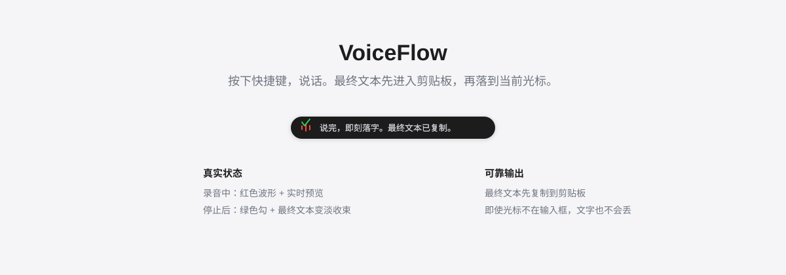

# VoiceFlow

<p align="right">
  <strong>简体中文</strong> · <a href="README.en.md">English</a>
</p>

> 开口，文字就位。

[](https://github.com/qinxujunai/VoiceFlow/actions/workflows/windows-quality.yml)
[](https://github.com/qinxujunai/VoiceFlow/releases/latest)



VoiceFlow 是 Windows 上的离线语音输入工具。按一下 `F2` 开始，再按一下完成；
无需切换应用，声音在本机变成文字，结果回到当前光标。

## 为什么是 VoiceFlow

- **离线使用**：安装后即可听写，录音和识别都在你的电脑上完成。
- **说完，接着写**：写邮件、记笔记、回消息。在输入框中按下 F2，说完再按一下。
- **随时回看**：在本地历史中查看和复制听写内容，需要时手动粘贴。
- **安静陪伴**：小胶囊在听写时显示文字，完成后收起。

## 下载

从 [GitHub Latest Release](https://github.com/qinxujunai/VoiceFlow/releases/latest) 下载最新的 Windows 安装包。
安装包已经包含默认离线模型，不需要 Python，安装完成即可使用。

系统要求：Windows 10 / 11 x64、可用麦克风。

### 更新与本地数据

VoiceFlow 不会在后台联网或静默更新。需要升级时，在托盘菜单打开设置，进入
“关于 VoiceFlow”并点击“检查更新”；只有 GitHub Release 同时提供匹配版本的
安装包和 `SHA256SUMS.txt`，且校验文件与安装包的 GitHub 摘要逐项匹配时，界面才会显示下载链接。
运行安装包升级不会删除 `%LOCALAPPDATA%\VoiceFlow` 中的配置、词典和模型。
历史页的“清除本机数据”仅在没有听写或恢复操作时，确认后删除本地听写历史和未交付录音，不会删除这些设置。

## 使用

| 按键 | 行为 |
| --- | --- |
| `F2` | 开始 / 停止语音输入 |
| `Right Ctrl` | 开始 / 停止语音输入 |
| `xbutton1` / `xbutton2` | 用鼠标侧键开始 / 停止 |
| `Esc` | 取消当前录音，不输出文字 |

正常输出链路：

```text
说话 → 本地识别 → 文本清理 → 剪贴板 → 当前光标 → 本地历史
```

## 隐私与联网

录音、转写、词库和历史默认只保存在本机。安装包不包含开发者或其他用户的
听写历史；历史页可以删除单条记录或清空全部。日常运行不会自动下载模型、
检查更新或调用云端识别服务。源码模式只有在用户明确准备模型时才会联网。

<details>
<summary><strong>开发、验证与许可</strong></summary>

### 从源码运行

```bat
git clone https://github.com/qinxujunai/VoiceFlow.git
cd VoiceFlow
start.bat
```

### 验证

```bat
venv\Scripts\python.exe scripts\verify.py
venv\Scripts\python.exe scripts\verify.py --release
```

- [质量门](docs/quality-gate.md)
- [ASR 评测计划](docs/asr-evaluation-plan.md)
- [模型策略与准入结论](docs/model-strategy.md)
- [产品质量标准](docs/product-quality-standard.md)
- [0.3.6 发布验证证据](docs/release-evidence-0.3.6.md)
- [运行时与用户数据边界](docs/runtime-boundary.md)
- [更新与本地数据契约](docs/upgrade-and-data-contract.md)
- [发布检查清单](docs/release-checklist.md)

项目代码基于 [MIT License](LICENSE) 开源。模型及第三方组件遵循各自许可证：

- [SenseVoice 再分发记录](docs/sensevoice-redistribution-decision.md)
- [Qt / PySide6 LGPL 合规记录](docs/qt-lgpl-compliance.md)
- [第三方声明](THIRD_PARTY_NOTICES.md)

</details>
